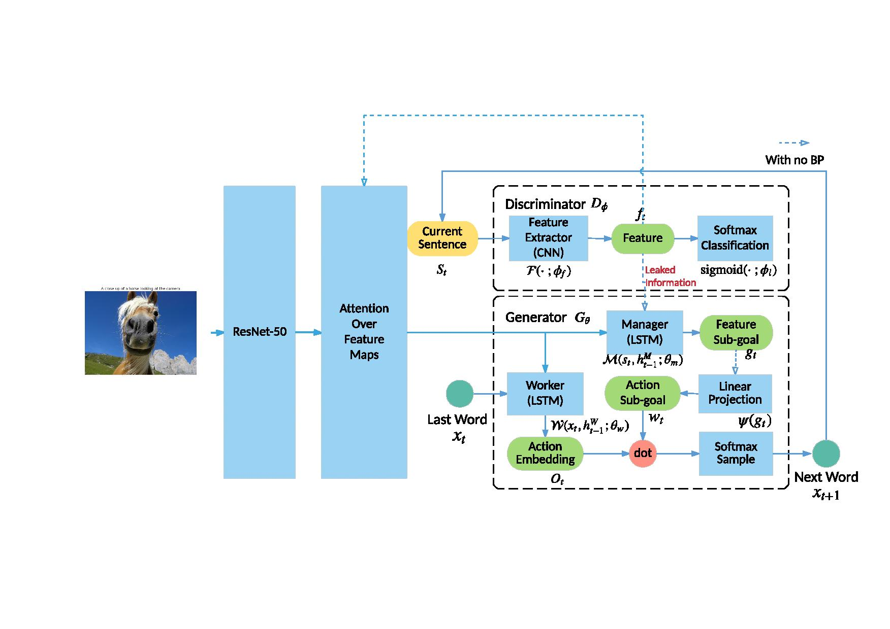

## Abstract
Inspired by recent progress of hierarchical reinforcement learning and adversarial text generation, we introduce a hierarchical adversarial attention based model to generate natural language description of images. The model automatically learns to align the attention over images and subgoal vectors in the process of caption generation. We describe how we can train, use and understand the model by showing its performance on Flickr8k. We also visualize the subgoal vectors and attention over images during generation procedures.

## Authors
